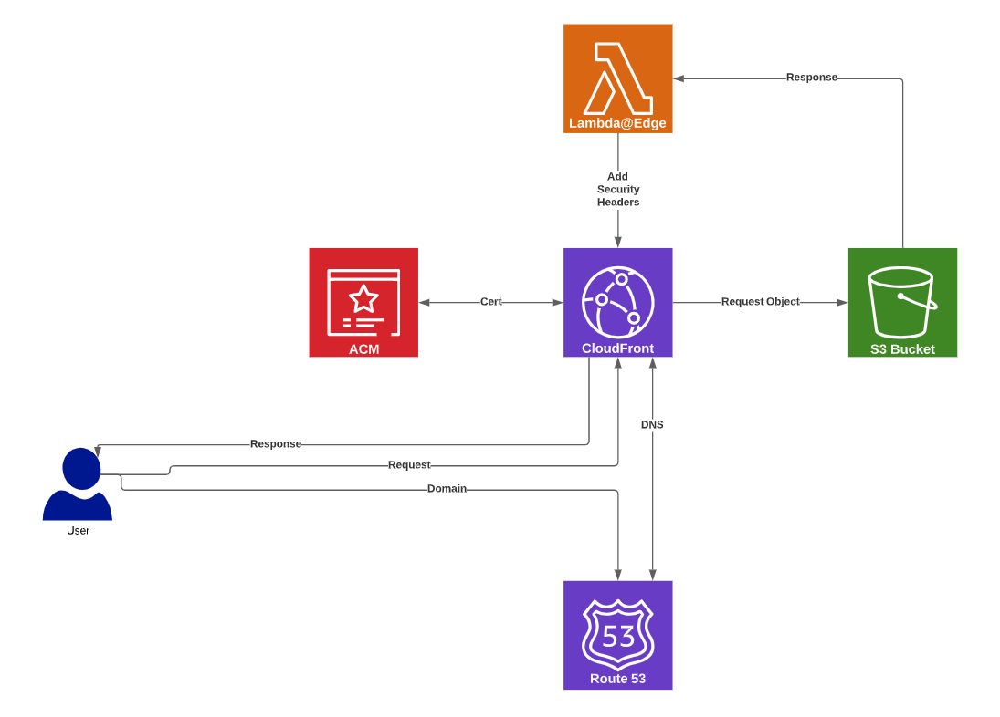

<p align="center">
  <a href="https://commercetools.com/">
    
  </a>
  <b>Merchant Center Custom Application</b><br />
  <b>Deploy to AWS</b>
</p>
<p>&nbsp;</p>

This repository assists in deploying a Merchant Center Custom Application to AWS using Terraform.

# High-level Architecture Diagram



# Prerequisite

Make sure you have the latest version of the following before deploying. (Or Your CI Platform is ready)

- `node.js`
- `npm`
- `yarn`
- `aws cli` - installed and configured
- `terraform`
- `git`
- `The DNS Domain of Your Site` (With edit rights to DNS Records)

You should already have a Merchant Center Custom Application built. Follow the getting started guide to install the [starter template](https://docs.commercetools.com/custom-applications/getting-started/installing-a-starter-application). You should have already completed the following steps:

## Adjust the cloud identifier

The `custom-application-config.json` is configured to use the HTTP APIs in the GCP-EU region. If you plan to run the Custom Application in another environment, change the cloud identifier accordingly.

## Adjust the configuration for production

The `custom-application-config.json` has a `env.production` configuration object. When you're ready to deploy the application to production, make sure to provide the URL where the Custom Application is hosted.

## Build the production bundles

Run the following command to build the production bundles with webpack:

```bash
$ yarn build
```

# Steps to Deploy

## Copy files

- Copy the `terraform` folder from this repository into your application.
- Copy the `config` folder from this repository into your application.

## Set Terraform Variables

- Edit [`variables.tf`](variables.tf) and edit the necessary variables
- Edit [`main.tf`](main.tf) and set the region and aws profile

### Verify Route53

If you don't already have a route53 hosted zone for your domain, create one now. Ensure that the DNS is configured properly.

### Obtain Certificate

1. Login to AWS Console
2. Select US East (N. Virginia) region (Need to obtain Global Cert for CloudFront)
3. Request or Import SSL Certificate to your domain, wildcard at that domain level is acceptable
4. Select Any suitable validation method (DNS or E Mail)
5. Note down the issued certificate . (It can take few minutes to get it issued)

_\* Note: This step can be automated using Terraform, but AWS can take up to 30 mins to issue a new cert and validation could take even longer. The delay can create problems for the terraform module deployment._

## Build the Resources

### Build the Custom Application

```bash
$ yarn build
$ yarn compile-html
```

### Generate the Lambda Function

You can compile manually with the command:

```bash
$ npx mc-scripts compile-html --transformer  config/transformer-aws.js
```

Or add it to your package.json for future use:

```json
  "scripts": {
    "compile-html:aws": "NODE_ENV=production dotenv -- mc-scripts compile-html --transformer  $(pwd)/config/transformer-aws.js",
  }
```

```bash
$ yarn compile-html:aws
```

## Deploy the Infrastructure

```bash
$ cd terraform
$ terraform init
$ terraform validate
$ terraform plan
$ terraform apply
```

## Copy the complied application to the newly created bucket.

```
aws s3 cp --recursive --acl public-read public/ s3://<spa-app-bucket-name>/
```

_\* Tip: [`aws s3 sync`](https://docs.aws.amazon.com/cli/latest/reference/s3/sync.html) can be used for updating the application_

## Register

Register the custom application within the Merchant Center.
